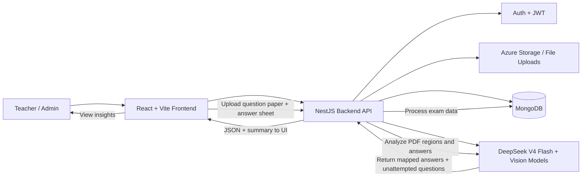

# Veda Assessments
>
> [Live](https://veda-assessments.jayowiee.com)

An AI Assistant to help teacher to upload a question paper and answer sheet and quickly understand which question was answered, where the answer is, and which questions were left unanswered.

> email me at <contact@jayowiee.com> for login creds

## Architecture Flow

## Tech

### Backend

### AI

### Frontend

